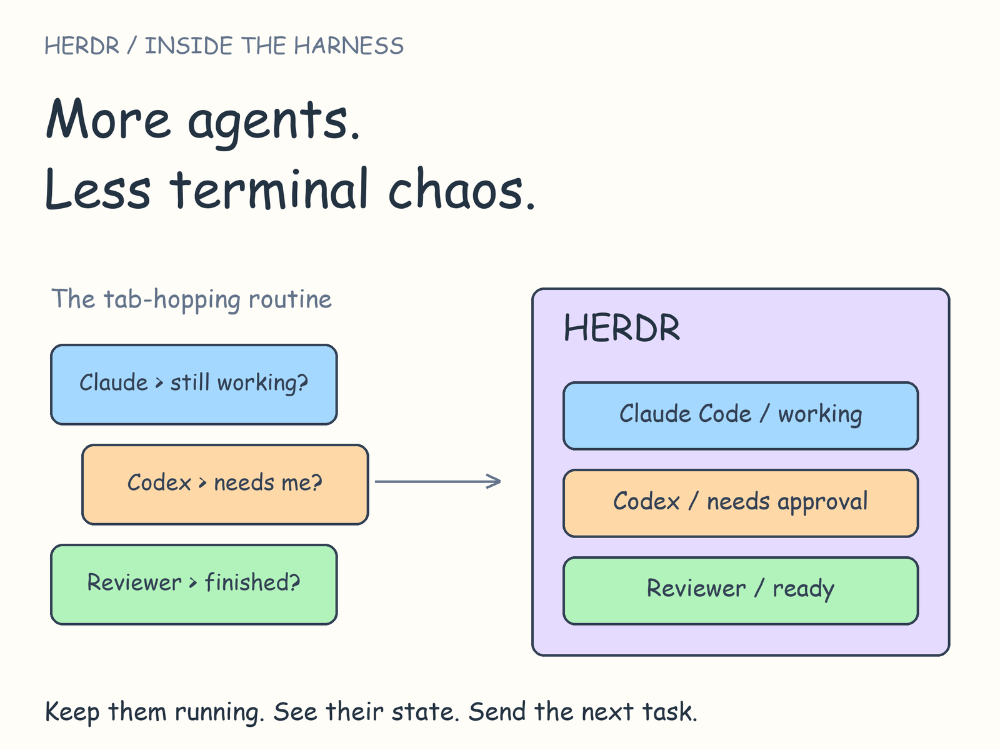
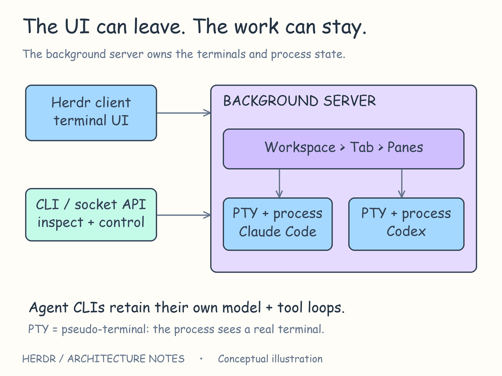
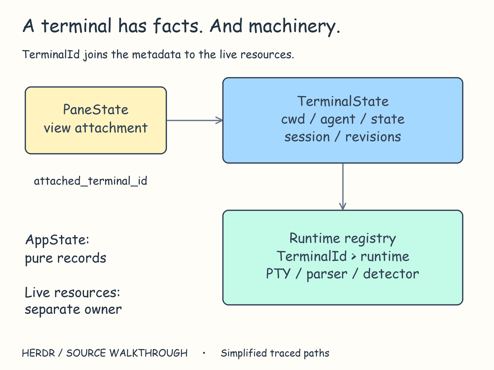
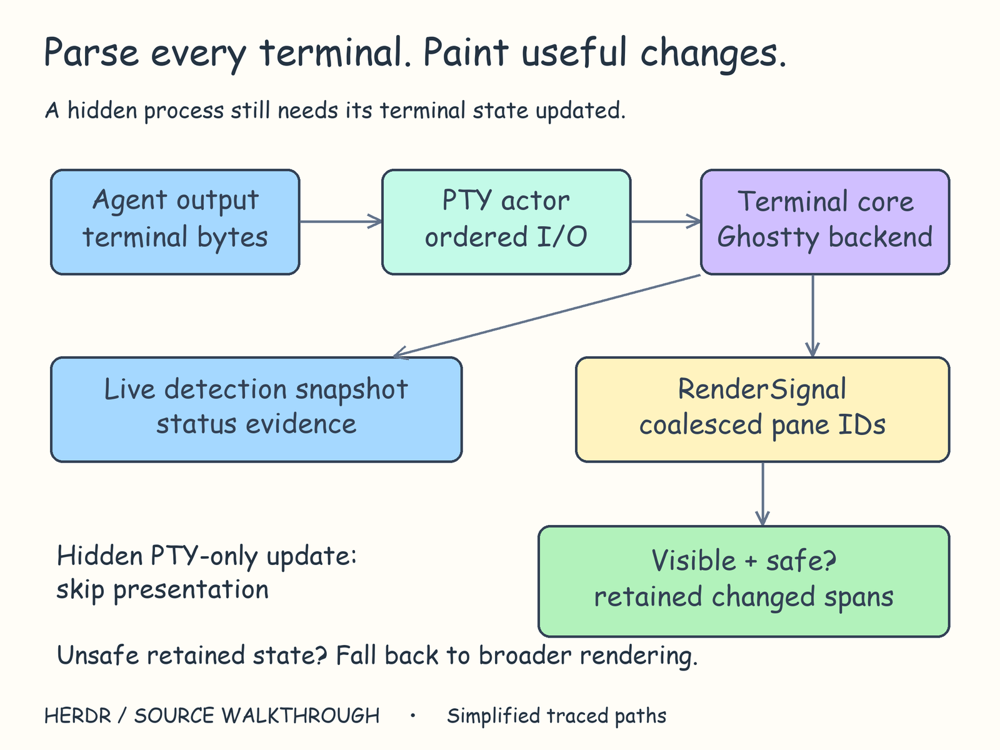
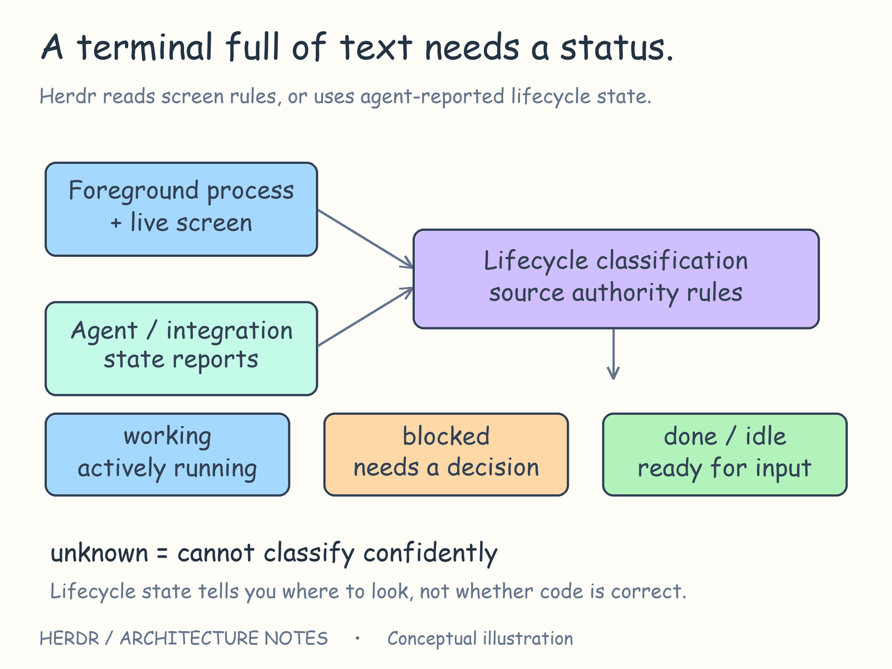
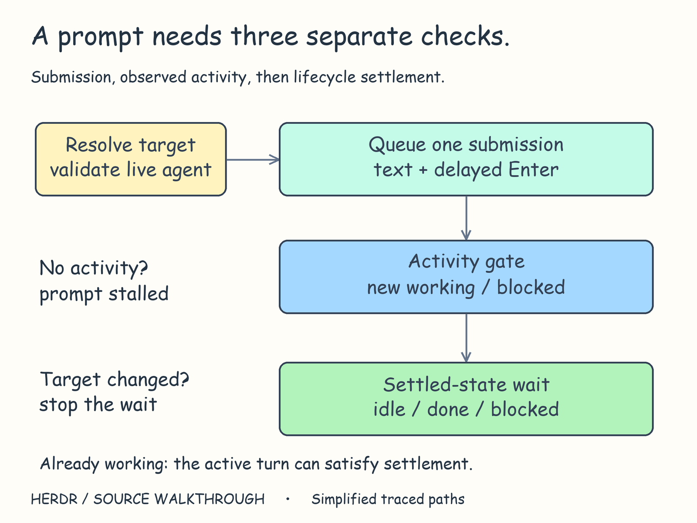
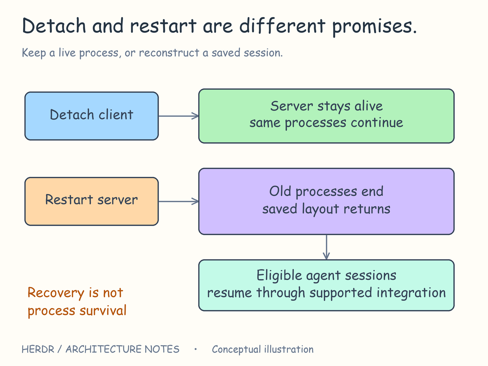

# Inside Herdr: more agents, less terminal chaos



Three coding agents. Three terminals.

One is editing. One needs your approval. One finished five minutes ago.

You keep switching tabs to find out which is which.

Running another agent is easy. Keeping track of its work is where things get interesting.

Herdr tackles that problem by putting existing coding agents in one place, with their terminals running in the background. It keeps them running, observes their state, and exposes controls that humans and other agents can use.

But how does it know an agent needs attention? What does “wait until finished” actually mean? And what survives when you disconnect?

I've been using and studying Herdr for a while now. The more I use it, the more interested I get in how it keeps all these moving parts together. Here's my breakdown of what happens underneath.

## First, know which layer you're looking at

“Harness” can describe quite different pieces of software.

A harness directly around a model can decide what goes into its context, execute its tool calls, and keep its reasoning-and-action loop going. LangChain's [Anatomy of an Agent Harness](https://www.langchain.com/blog/the-anatomy-of-an-agent-harness) walks through that layer.

Herdr works around already-running coding agents. Those agents bring their own model loop, tools, and conversation management. Herdr gives their terminal processes a shared home and a way to be observed and coordinated.

That boundary matters.

Herdr can send input to an agent and inspect its terminal. With an integration, it can receive more explicit status reports. But it doesn't automatically know everything happening inside that agent's model loop.

**To coordinate an agent, Herdr needs to know what that agent is doing.**

Imagine a small workflow: an implementation agent edits a feature, a reviewer checks the diff, and you handle the decisions that need a human. Let's follow what Herdr has to do to keep that workflow usable.

## Keep the work alive when the view goes away

You start the agents, then disconnect from the interface.

Should that end their work?

Herdr separates the background server from the terminal interface attached to it. The server owns the running terminals. The interface is a client that displays and controls it.



*The view can disconnect while the server and its agents continue running.*

At startup, Herdr launches the server without needing an attached interface. The interface and automation commands have separate connections into that same server.

The useful distinction is simple: losing your view of an agent and losing the agent itself are different events.

[In the code: server bootstrap](https://github.com/herdrdev/herdr/blob/331775c3e51e8cca4d122468180738101bd9e6b0/src/server/headless/bootstrap.rs#L4).

### A window isn't the work

The state model makes a similar distinction.

A **pane** is the view attached to a terminal. A **terminal record** holds its identity, directory, agent status, and session references. A separate **runtime registry** keeps track of the running terminals and the resources they use.



*The terminal ID connects the visible pane, the record, and the running machinery.*

The code calls those pieces `PaneState`, `TerminalState`, and `TerminalRuntimeRegistry`. Keeping them separate lets Herdr reason about an agent's state without putting an OS process or terminal parser inside that record.

The split is still being worked through: at this version, each terminal is paired with a pane. The code separates their responsibilities, but they are still connected.

For builders, the idea is useful beyond terminals: give the work an identity that makes sense independently of its current view.

[In the code: terminal state](https://github.com/herdrdev/herdr/blob/331775c3e51e8cca4d122468180738101bd9e6b0/src/terminal/state.rs#L124) · [runtime registry](https://github.com/herdrdev/herdr/blob/331775c3e51e8cca4d122468180738101bd9e6b0/src/terminal/runtime_registry.rs#L5) · [pane state](https://github.com/herdrdev/herdr/blob/331775c3e51e8cca4d122468180738101bd9e6b0/src/pane/state.rs#L1).

## Turn terminal output into something you can act on

Your implementation agent starts working. Text appears, spinners move, lines get rewritten.

A terminal isn't just a log file. Programs can move the cursor, replace existing text, change screen modes, and ask the terminal to respond.

Herdr runs those programs through a **PTY**, or pseudoterminal: the OS interface that lets a program behave as though it's connected to an interactive terminal.

One part of Herdr reads and writes the terminal data. Another interprets it into the current screen. Herdr then uses that screen to figure out the agent's status and update what you see.



*One output stream feeds the terminal screen, status detection, and presentation.*

On Unix, the input and output handler runs on its own thread. Incoming output updates the terminal screen and tells the rest of Herdr what changed. Windows has its own implementation of that handler.

[In the code: Unix PTY actor](https://github.com/herdrdev/herdr/blob/331775c3e51e8cca4d122468180738101bd9e6b0/src/pty/actor/unix.rs#L375) · [pane read callback](https://github.com/herdrdev/herdr/blob/331775c3e51e8cca4d122468180738101bd9e6b0/src/pane.rs#L2630).

### Hidden doesn't mean stopped

You switch to the reviewer's tab. The implementation agent keeps producing output.

Herdr still needs to parse that output and maintain its terminal state. It can, however, avoid presentation work when terminal output changes only in panes that nobody is viewing.

For suitable visible updates, it compares changed rows with the previous screen and redraws only the parts that need updating. Conditions such as a required full redraw or popup state can send it through the broader render path.

The design separates two obligations: keep the background terminal state current, and spend screen-painting effort where someone can see it.

[In the code: visibility-aware render decision](https://github.com/herdrdev/herdr/blob/331775c3e51e8cca4d122468180738101bd9e6b0/src/server/headless.rs#L548) · [retained surfaces](https://github.com/herdrdev/herdr/blob/331775c3e51e8cca4d122468180738101bd9e6b0/src/server/headless/retained_surface.rs#L42).

## “Needs approval” is a harder label than it looks

An agent stops printing. Has it finished? Is it thinking? Is it asking a question?

Herdr combines screen and process evidence with status reports from supported integrations.

Its screen detector reads the latest terminal content. Scrolling up to yesterday's approval prompt shouldn't make today's agent look blocked.

Agent-specific rule files describe the patterns that matter for each agent. The Codex manifest distinguishes startup trust prompts, approval requests, questions, and working signals, giving stronger signals priority and excluding misleading patterns.



*The status is a decision based on evidence about the current agent.*

[In the code: Codex detection manifest](https://github.com/herdrdev/herdr/blob/331775c3e51e8cca4d122468180738101bd9e6b0/src/detect/manifests/codex.toml).

There's a small detail I particularly like: an ambiguous transition from working to apparently idle can be held for confirmation. A brief intermediate redraw shouldn't immediately become a “finished” signal. Clearly visible signs that the agent is idle can bypass that hold.

[In the code: idle confirmation](https://github.com/herdrdev/herdr/blob/331775c3e51e8cca4d122468180738101bd9e6b0/src/pane/agent_detection.rs#L1).

### What happens when observations disagree?

An integration might report “working” while the screen appears to show an approval request.

Herdr has rules for who gets to speak for the agent. Some integrations are trusted to report the agent's full status. While one of those integrations is active, Herdr skips its usual screen-based checks. For other integrations, a fresh approval prompt on screen can override a report that says the same agent isn't blocked.

It also checks which conversation a report belongs to and the order in which reports arrive. A late report from another conversation shouldn't quietly update the current one.

This is a distinctive part of Herdr's job. Coordinating existing command-line agents means reconciling observations from systems whose internals it doesn't own.

[In the code: authority categories](https://github.com/herdrdev/herdr/blob/331775c3e51e8cca4d122468180738101bd9e6b0/src/detect/mod.rs#L323) · [state arbitration](https://github.com/herdrdev/herdr/blob/331775c3e51e8cca4d122468180738101bd9e6b0/src/terminal/state.rs#L2093) · [session-aware report routing](https://github.com/herdrdev/herdr/blob/331775c3e51e8cca4d122468180738101bd9e6b0/src/terminal/state.rs#L940).

## Sending work and seeing progress are separate steps

Now ask the reviewer to inspect the diff.

```sh
herdr agent prompt reviewer "Review the current diff; report correctness risks without editing." --wait
herdr agent read reviewer
```

*Illustrative commands for an existing named agent.*

Before sending input, Herdr checks that the target is recognized, isn't waiting for approval or still starting up, and is still the program receiving terminal input.

Otherwise, a review instruction could arrive at an approval dialog or at a shell left behind by an exited agent.

Submission is also a terminal interaction. Herdr encodes the prompt and Enter separately, then queues them in order. Some agents need extra handling: on Windows, Codex gets an extra key event so Enter submits the prompt instead of becoming part of the pasted text.

[In the code: prompt validation and submission](https://github.com/herdrdev/herdr/blob/331775c3e51e8cca4d122468180738101bd9e6b0/src/app/api/agents.rs#L111).



*Send the input. Look for activity. Then wait until the agent is ready again.*

### The idle-agent trap

Suppose the reviewer was idle before submission. Immediately finding it idle again doesn't establish that it received the prompt.

Herdr records the earlier status and where it is in the stream of events. When work wasn't already active, its wait path looks for newer working or blocked activity before waiting for the agent to become ready again. If that activity doesn't appear within the allowed window, it can report `agent_prompt_stalled`.

The wait also checks that it is still watching the same agent. Moving, closing, or replacing that agent can affect the wait.

Underneath, it keeps a recent event history and checks it at intervals, reading the current agent status when needed. It isn't a unique receipt proving that each individual prompt completed. If the agent was already working, that existing work finishing can satisfy the wait.

[In the code: prompt activity gate and wait](https://github.com/herdrdev/herdr/blob/331775c3e51e8cca4d122468180738101bd9e6b0/src/api/wait.rs#L179).

And even a correctly observed idle state only tells you whether the agent is working or waiting. You still need to read the review and validate the change.

LangChain's [Deep Agents writeup](https://www.langchain.com/blog/improving-deep-agents-with-harness-engineering) tackles verification from inside an agent harness, adding guidance and a completion checklist. Herdr's status tracking answers a different question: is this terminal agent working, blocked, or ready for more input?

**Finishing a turn and finishing the job are separate claims.**

## Coming back has more than one meaning

You disconnect, return later, and see your workspace again.

What exactly survived?



*Keeping a process alive and reconstructing a session preserve different things.*

Herdr has several paths:

- **Detach:** the client disconnects; the running server can keep its processes alive.
- **Restore:** saved layout, directories, names, and session references reconstruct the workspace.
- **Resume:** supported agent session references become commands such as `codex resume <id>` or `claude --resume <id>`.
- **Live handoff:** a replacement server takes over the running terminals; on Unix, it receives the open OS handles needed to access them.

A saved session file doesn't contain an arbitrary running process.

The writer also protects earlier state. If a previous session file couldn't be loaded, it attempts to preserve a recovery copy before replacing it. Failure to preserve those bytes blocks the save.

[In the code: snapshot](https://github.com/herdrdev/herdr/blob/331775c3e51e8cca4d122468180738101bd9e6b0/src/persist/snapshot.rs#L13) · [recovery-aware writer](https://github.com/herdrdev/herdr/blob/331775c3e51e8cca4d122468180738101bd9e6b0/src/persist/writer.rs#L9) · [resume planning](https://github.com/herdrdev/herdr/blob/331775c3e51e8cca4d122468180738101bd9e6b0/src/agent_resume.rs#L198) · [handoff import](https://github.com/herdrdev/herdr/blob/331775c3e51e8cca4d122468180738101bd9e6b0/src/server/headless/bootstrap.rs#L136).

This distinction matters when reading other harness designs too. Anthropic's [long-running agents article](https://www.anthropic.com/engineering/effective-harnesses-for-long-running-agents) uses progress records and Git history to help a fresh agent session continue the project. That's continuity of work across sessions. A process remaining alive is another guarantee entirely.

## What I'd take from this design

Herdr's interesting choices follow from its position around existing agents:

- **Keep running agents separate from their interface.** Closing a view doesn't have to end the work.
- **Check which agent and conversation a status belongs to.** A status without a current process and session behind it can mislead.
- **Separate sending input, seeing activity, and becoming ready again.** Each stage needs its own evidence.
- **Keep background state current without painting every update.** A hidden terminal still needs to stay up to date.
- **Say exactly what recovery preserves.** Layout, conversation, and process continuity are different promises.

The question I came in with was “how does Herdr manage several agents?”

The answer lives in the details between them: terminal input, current evidence, stable identity, and ways to come back to the work.

Once those pieces are dependable, running more agents becomes easier to reason about.

## More to read

A few articles worth reading alongside this one:

- [Pi: What I learned building an opinionated and minimal coding agent](https://mariozechner.at/posts/2025-11-30-pi-coding-agent/) — why its creator chose a small core and external tools.
- [Anthropic: Effective harnesses for long-running agents](https://www.anthropic.com/engineering/effective-harnesses-for-long-running-agents) — how agents carry progress across sessions.
- [Cursor: Dynamic context discovery](https://prod.cursor.com/blog/dynamic-context-discovery) — letting agents pull in information when they need it.
- [LangChain: The Anatomy of an Agent Harness](https://www.langchain.com/blog/the-anatomy-of-an-agent-harness) — a breakdown of what surrounds the model.
- [LangChain: Improving Deep Agents with harness engineering](https://www.langchain.com/blog/improving-deep-agents-with-harness-engineering) — using failures to improve verification and agent behavior.

---

Written by **shipitdev (Harsh K. Singh)** · [GitHub](https://github.com/shipitdev) · [LinkedIn](https://linkedin.com/in/shipitdev) · [X](https://x.com/heyshipitdev)

> **A note on the writing:** Most of the ideas and explanations here came from my own use and study of Herdr. I used an LLM to help make the writing easier to follow and add sources so you can dig into the details yourself.

Code links refer to Herdr [`331775c`](https://github.com/herdrdev/herdr/tree/331775c3e51e8cca4d122468180738101bd9e6b0) (`0.9.3`). The diagrams simplify the implementation; the command example is illustrative.

Explore: [Herdr](https://github.com/herdrdev/herdr) · [Docs](https://herdr.dev/docs/) · [Editable diagrams](assets/README.md)
